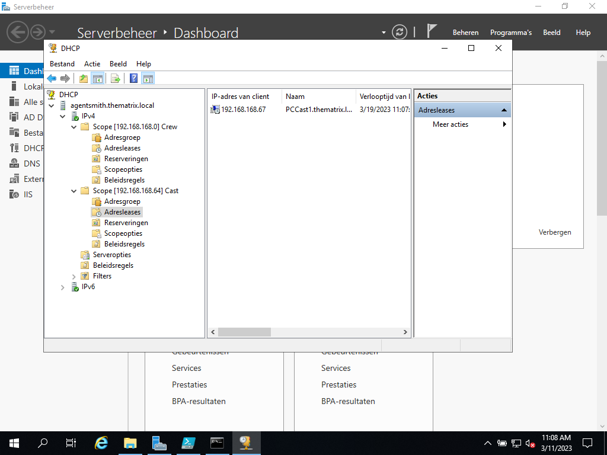

# Testrapport Opdracht 3.3: DC deel DHCP

## Test

Uitvoerder(s) test: Jonas Feys
Uitgevoerd op: 11/03/2023
Github commit:  COMMIT HASH

## Functies

Voorbereiding: de nodige testopstelling voorbereid en daarna Script voor DHCP uitgevoerd.

### Test crew PC

1. netwerkadapter aangepast om automatisch IP-adres te ontvangen
2. in cmd `ipconfig /release`en `ipconfig /renew`
3. Het ip adres werd gewijzigd naar een adres uit de beschikbare pool voor  crewleden
4. de lease is toegevoegd in de DC

### Test cast PC

1. netwerkadapter aangepast om automatisch IP-adres te ontvangen
2. in cmd `ipconfig /release`en `ipconfig /renew`
3. Het ip adres werd gewijzigd naar een adres uit de beschikbare pool voor  crewleden
4. de lease is toegevoegd in de DC

