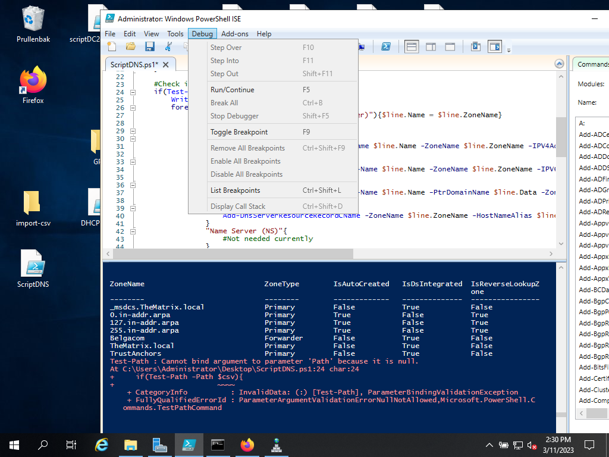

# Testrapport Opdracht DC: DNS

## Test

Uitvoerder(s) test: Jonas Feys 
Uitgevoerd op: 11/03/2023
Github commit:  COMMIT HASH

## testen

Het script breekt af bij het testen van het Path van te importeren bestand, waarde is "null".
Het Path waar ik het bestand geplaatst heb zou correct moeten zijn.

Bij aan passen van de variabele $csv, wegdoen van `Import-Csv`loopt het script wel door maar wordt er niets geïmporteerd.

CNAME nog toe te voegen voor rallly.thematrix.local
     - naam = rallly (3 x een l)
     - redirect naar de webserver

Nog te bekijken hoe we thematrix.local redircten naar de webserver, thematrix.local wijst nu naar de DC.