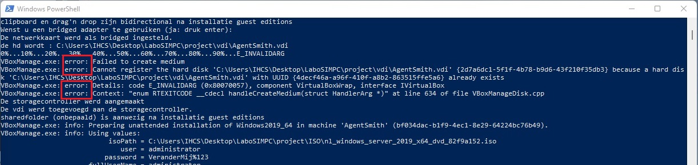
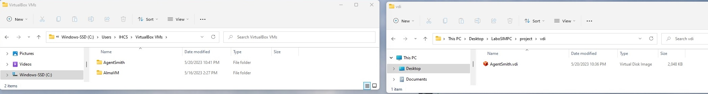
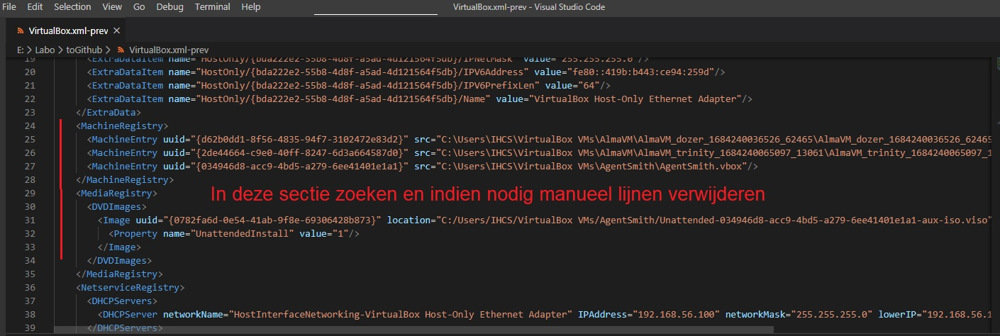
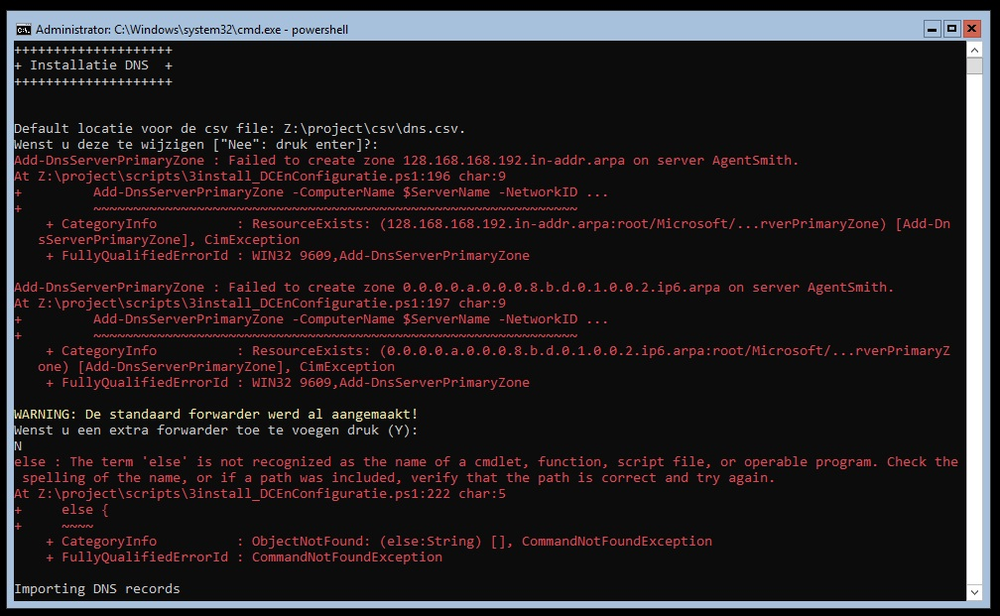

# System Engineering Project - Opdracht Domain controller - voorbereidende test

## **Overzicht issues en oplossingen/reminders/tips**

### issue dat de VM niet met naam AgentSmith kon aangemaakt worden 
* Na grondig nalezen messages, bleken er ook error messages te zijn: <br/>
 <br/>
Er was kennelijk een restant van een oude VM achtergebleven op de Host-machine, windowsinstallatie faalde.
Daarom volgende acties moeten doen: 
    * Remove van de VM
    * manueel delete-en van de vdi of folder in: 
        * C:\Users\IHCS\VirtualBox VMs\AgentSmith
	    * C:\Users\IHCS\Desktop\LaboSIMPC\project\vdi
     <br/>
    * aanpassingen in de file (HD en snapshots manueel verwijderd).
    Dit stond er:
    ```
    <MediaRegistry>
      <HardDisks>
        <HardDisk uuid="{4decf46a-a96f-410f-a8b2-863515ffe5a6}" location="C:/Users/IHCS/Desktop/LaboSIMPC/project/vdi/AgentSmith.vdi" format="VDI" type="Normal">
          <HardDisk uuid="{40ce786f-7be9-4360-860e-6a4ac75c4d79}" location="C:/Users/IHCS/VirtualBox VMs/AgentSmith/Snapshots/{40ce786f-7be9-4360-860e-6a4ac75c4d79}.vdi" format="VDI">
            <HardDisk uuid="{60df6001-9120-4974-a8fb-d389a2887061}" location="C:/Users/IHCS/VirtualBox VMs/AgentSmith/Snapshots/{60df6001-9120-4974-a8fb-d389a2887061}.vdi" format="VDI"/>
          </HardDisk>
          <HardDisk uuid="{95423775-81f9-425a-887e-5b003810a4b0}" location="C:/Users/IHCS/VirtualBox VMs/AgentSmith/Snapshots/{95423775-81f9-425a-887e-5b003810a4b0}.vdi" format="VDI"/>
        </HardDisk>
      </HardDisks>
    </MediaRegistry>
    ```
     <br/>
* Andere oplossing was: 
    * VM aanmaken met een andere naam tijdens script1
    * Vooraleer script2 te runnen de host-naam te veranderen (hostname wordt immers zelfde als VM-naam)
        * PS>Rename-Computer AgentSmith
    * restart (hostname wordt actief) en verder gaan met het runnen van script2

## tips
* Zeker een geldig recovery-password ingeven tijdens windows-installatie => blijf dus bij VeranderMij%123. We doen toch geen recovery. <br/>
Indien password niet geaccepteerd, volgen errors => stress
* Op de Qwerty machine 1ste lijn in commentaar zetten in post-installscript: <br/>
    ```
    #powershell -command "Set-WinUserLanguageList nl-BE -force"
    ```
    Anders manuel volgend commando geven:
    ```
    PS>Set-WinUserLanguageList nl-NL -force
    ```
* los qwerty en azerty keyboard meenemen naar demo
* Eventueel nog VM-name onafhankelijk maken van host-name in script1
* dns-idempotentie nog oplossen <br/>
  <br/>


