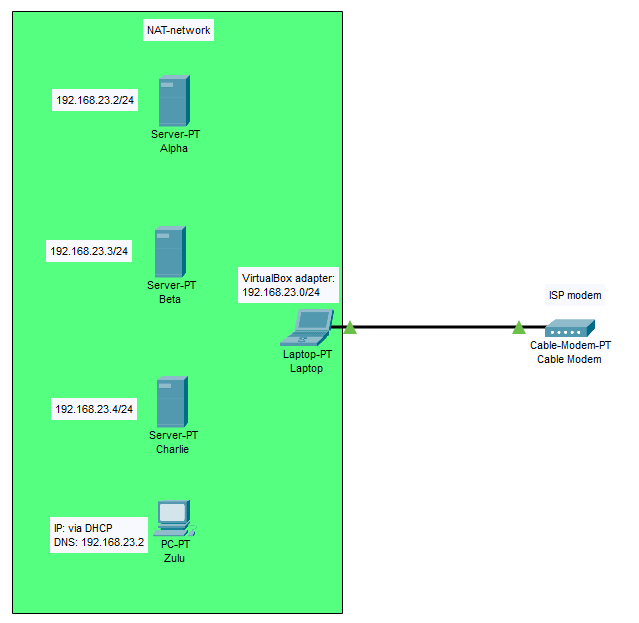

# Documentatie labo Windows Server 2

Jonas Feys - TIAO

## Gegevens en vereisten van de opdracht

- Beheer van (interne) gebruikers via Active Directory,
- DHCP en DNS voor alle clients in het netwerk,
- Een CA (certificate authority) voor het beheren van certificaten binnen het domein,
- Een SharePoint Server voor het intranet en private cloud storage via OneDrive,
- Een Microsoft SQL Server voor de opslag van SharePoint data,
- Eén of meerdere Windows 10 of 11 clients voor uittesten van de verschillende diensten.

### Vereisten

- VirtualBox NAT network
- IP-adres in de range 192.168.23.0/24
- Servers: vast IP-adres in de range 192.168.23.1 - 192.168.23.50
- Windows 10 clients: dynamisch IP-adres via DHCP in de range 192.168.23.51-192.168.23.100
- Alle toestellen behoren tot 1 domein
  - naam domein: WS2-2324-jonas.hogent
  - Forest functional level: Windows Server 2016
  - Domain functional level: Windows Server 2016
- Redundante DNS-server

## Opstelling

Voor deze opdracht maken we gebuik van het NAT network in virtualbox. 
De VM's zitten in een intern netwerk zodanig dat ze kunnen communiceren en uitgaand verkeer is ook mogelijk.

### Adresseringstabel IPV4

dhcp scope PC:      192.168.23.51 - 192.168.23.100

| Toestel   | Interface      | IP address      |Subnet Mask    |Default Gateway |DNS server   |
| :---      | :---           | :---            | :---          |:---            | :---        |
|Alpha      | NIC            | 192.168.23.2    |255.255.255.0  |192.168.23.1    |------       |
|Beta       | NIC            | 192.168.23.3    |255.255.255.0  |192.168.23.1    |------       |
|Charlie    | NIC            | 192.168.23.4    |255.255.255.0  |192.168.23.1    |------       |
|PC Zulu    | NIC            | dhcp            |dhcp           |dhcp            |192.168.23.2 |
|host PC    | VirtualBox NIC | 192.168.23.0    |255.255.255.0  |192.168.23.1    |------       |
|host PC    | NIC            | via ISP         |via ISP        |via ISP         |------       |

## Keuzes

### Server 1: Alpha

#### Functionaliteiten

- Besturingssysteem: Windows server 2019 GUI
- IP-adres: 192.168.23.1/24
- Rollen
  - Active Directory Domain Controller
  - DNS
  - DHCP

#### Motivatie

Het is een logische keuze om zowel de DC, DNS en DHCP rollen op eenzelfde server te installeren. 
Na de installatie van de DC rol op de server kan DNS en DHCP eenvoudig worden geïntegreerd in het script samen met de overige configuratie.  
De keuze van de recources is gebasseerd op de minimale vereisten aangeraden door Microsoft. 
Bij een GUI installatie wordt aangeraden om minimaal 32 GB vrije opslagruimte te hebben. 
Om voldoende ruimte te hebben voor de overige rollen opteer ik voor 40 GB.

<https://learn.microsoft.com/en-us/windows-server/get-started/hardware-requirements>

#### Recources

- 2GB vRAM
- 2 vCPU kernen
- 40 GB vDisk

### Server 2: Beta

#### Functionaliteiten

- Besturingssysteem: Windows server 2019 CLI
- IP-adres: 192.168.23.2/24
- Rollen
  - DNS redundante server
  - CA
  - SQL Server

#### Motivatie

DNS en Certification Authority nemen beide niet veel recources in. 
Daarmee maak ik de keuze om deze te combineren met de SQL server. 
Indien blijkt dat ik over voldoende reserve recources beschik om de SQL server apart te zetten, dan maak ik de keuze om dit alsnog te doen. 
Ik combineer ze nu vooral omdat ik nog geen zicht heb op hoeveel recources Sharepoint juist nodig heeft. 

https://www.microsoft.com/en-us/download/details.aspx?id=101064

#### Recources

- 2GB vRAM
- 1 vCPU kern
- 40 GB vDisk

### Server 3: Charlie

#### Functionaliteiten

- Besturingssysteem: Windows server 2019 CLI
- IP-adres: 192.168.23.3/24
- Rollen
  - Sharepoint server

#### Motivatie

Het lijkt mij logisch om de sharepoint server volledig apart te voorzien want in een bedrijfsomgeving kan deze server veel recources nodig hebben. 
Volgens Microsoft hebben is er 12GB RAM nodig indien sharepoint en Database server (Three-tier farm configuration) gescheiden worden. 
Als we 12GB toekennen voldoen we niet meer aan de vooropgestelde eisen van maximaal 16GB RAM.

#### Recources

- 6GB vRAM
- 2 vCPU kernen
- 40 GB vDisk

### Client: Zulu

#### Functionaliteiten

- Besturingssysteem: Windows 10
- IP-adres: via DHCP
- Rollen
  - SQL Server Management Studio (SSMS)

#### Motivatie

De keuze van de recources is gebasseerd op de minimale vereisten aangeraden door Microsoft. 
Ik voorzie 25GB disk space ipv 20GB doordat SQL Server Management Studio ook geïnstalleerd wordt.

<https://support.microsoft.com/en-us/windows/windows-10-system-requirements-6d4e9a79-66bf-7950-467c-795cf0386715>

#### Recources

- 2GB vRAM
- 1 vCPU kern
- 25 GB vDisk

## Info/bronnen

### sharepoint

<https://learn.microsoft.com/en-us/sharepoint/install/install-sharepoint-server-2016-on-one-server>
<https://www.youtube.com/watch?v=Sjl3ixS_724>
<https://learn.microsoft.com/en-us/sharepoint/sites/set-up-onedrive-for-business>

### certificate Authority (CA)

<https://learn.microsoft.com/en-us/windows-server/networking/core-network-guide/cncg/server-certs/install-the-certification-authority>
<https://learn.microsoft.com/en-us/powershell/module/adcsdeployment/install-adcscertificationauthority?view=windowsserver2022-ps>

### SQL

<https://www.youtube.com/watch?v=GpXpn79kWDs&t=80s>
<https://www.youtube.com/watch?v=GpXpn79kWDs>
